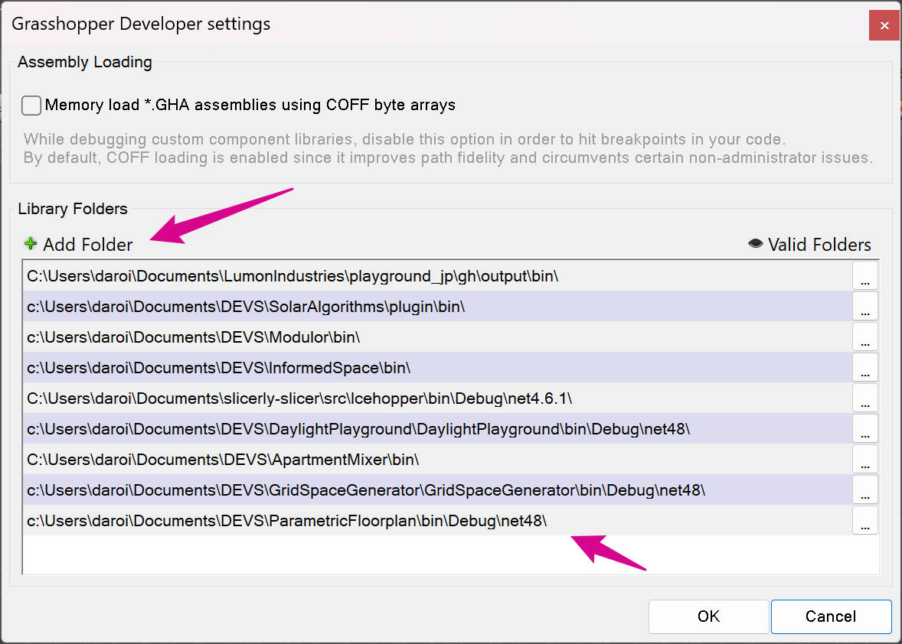

# Blank Grasshopper project

## Developer notes

This is a basic setup for VS Code with debugging via F5.

Change all GUIDs in Components, Types, Parameters and in the `.csproj` file.

Build. Open Rhino and type command `GrasshopperDeveloperSettings` and add a path to the `bin` folder. Then close Rhino and run debugging.
